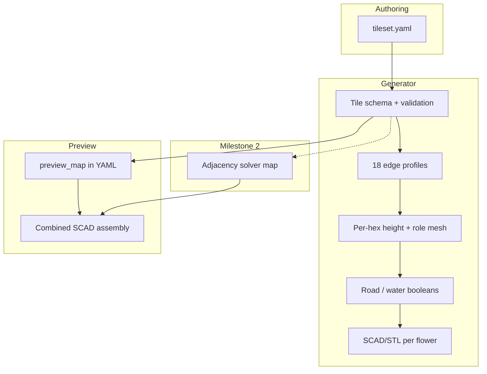

# 3D modular hex-flower terrain

**Overview:** Extend the existing 7-hex flower generator into a declarative 3D terrain system: three terrain heights (~2 cm per step at print scale), water one step below local terrain, standardized edge profiles on all 18 exterior sides, and a tileset YAML that drives sample flowers plus a manual combined preview map—with a follow-up milestone for rule-aware auto-layout.

## What you are building (shared understanding)

A **tabletop hex terrain product** where the printable unit stays the **7-hex flower** ([`printableFiles/hexagon.py`](../../printableFiles/hexagon.py)), magneted on exterior sides like today. Each flower is a sculpted base plate, not seven separate prints.

**Gameplay surface rules (from grill):**

- Each of the 7 hex cells is **discrete**: either **mini-standable** (flat pad) or **non-standable** (changes height, blocks, road channel, water, slope, etc.).
- Every flower must have **≥1 standable** hex.
- **Terrain height** is 3 levels: `ground`, `middle`, `high` (~**2 cm per step** at print scale — dramatic relief).
- **Water** sits **one terrain step below** the local hex’s terrain height (can read as “slightly below” the surface).
- **Roads** remain **carved channels** at the hosting hex’s terrain height (same idea as today’s `street_indent_height`, generalized per level).
- **Combinations** (e.g. road + river → bridge with stand-under and stand-on) are in scope conceptually; **bridge/deck as magnet toppings** lands **after MVP**.
- **Modularity across flowers** is enforced by **18 standardized exterior hex edges** (6 ring hexes × 3 outward-facing sides each): each edge has a **profile** from a catalog; two flowers may connect only if joined profiles are compatible.
- **Authoring**: a **tileset definition file** (YAML) lists all flowers + rules; you want a **combined terrain preview** and eventually a **small map generator** that places every flower at least once while respecting adjacency—**MVP uses a manual preview map**; auto-layout is milestone 2 once profiles validate.



## Current codebase leverage

[`printableFiles/hexagon.py`](../../printableFiles/hexagon.py) already encodes the hard parts to preserve:

| Existing piece | Reuse for 3D |
|----------------|--------------|
| 7-hex flower layout + `innerHexagonSize` spacing | Same graph; add Z per cell |
| `outerHexagonVertecies` + edge lines | Attach **edge profile** metadata to each exterior side |
| `getOuterHexFlowerLines` / `getCenterOfThreeLines` | Road/water entry at **3-hex junctions** (6 per flower) |
| `addBevel`, `addMagnetHoleOnSide` | Keep on exterior edges; extend bevel depth with height delta |
| `path_sweep` + bezier streets | Road channel cutter, lifted to hex’s terrain Z |
| Magnet + topping holes | Unchanged for MVP; bridge pieces later |

Print scale stays **`scale(5)`** on export. With **20 mm per height step**, model-space step ≈ **`4.0`** units before scale (`20 mm / 5`).

## Tile schema (YAML) — MVP shape

One file per tileset, e.g. [`tilesets/default.yaml`](../../tilesets/default.yaml):

```yaml
meta:
  height_step_mm: 20
  scale: 5
  hex_outer_width: 5.1961525  # or derived from existing constant

preview_map:  # MVP: explicit flower placements
  - { id: flat_plains, at: [0, 0], rot: 0 }
  - { id: hill_north, at: [1, 0], rot: 2 }
  # ...

flowers:
  flat_plains:
    hexes:  # indices 0=center, 1-6 ring CCW
      "0": { terrain: ground, role: standable }
      "1": { terrain: ground, role: standable }
      # ...
    edges:  # 18 exterior edges keyed by stable id (hex_index, side_index)
      "1-0": { profile: flat_ground }
      "1-1": { profile: flat_ground }
      # ...
    roads:
      - { entry_junction: 0, exit_junction: 4 }  # maps to today's index pairs
    water: []

  hill_north:
    hexes:
      "0": { terrain: middle, role: slope }
      "3": { terrain: high, role: standable }
      # ...
    edges:
      "3-0": { profile: slope_up_ground_to_middle }
      # ...
```

**Validation rules (generator must fail fast):**

- ≥1 hex with `role: standable`
- Every `edges` key resolves to a real exterior side
- `preview_map` connections: adjacent flowers’ touching edges have **compatible profiles**
- Road/water junction indices ∈ [0, 5]

**Edge profile catalog (initial set):**

- `flat_ground`, `flat_middle`, `flat_high`
- `slope_up_*`, `slope_down_*` between adjacent levels (for exterior transition geometry)
- `cliff_*` (impassable vertical; height discontinuity)
- `road_port` / `water_port` modifiers or tagged combinations for later bridge tiles

Compatibility = symmetric pairs (e.g. `flat_middle` ↔ `flat_middle`, `slope_up_ground_to_middle` ↔ `slope_down_middle_to_ground`).

## Geometry approach (MVP)

1. **Refactor** [`printableFiles/hexagon.py`](../../printableFiles/hexagon.py) into a small package, e.g. `terrain/`:
   - `layout.py` — flower hex positions/vertices (extract existing math)
   - `mesh.py` — build per-hex prism/slab at terrain Z + blend slopes between neighbors inside same flower
   - `edges.py` — exterior profile → bevel/magnet/cliff mesh along side lines
   - `features.py` — road/water cutters (port existing bezier logic, Z from host hex)
   - `tileset.py` — load YAML, validate, dispatch build
   - `cli.py` — `render flower <id>`, `render preview <tileset>`

2. **Per-hex solid**: subdivided hex polygon extruded to `terrain_z`, top face flat for `standable`, chamfered or sloped to neighbors for `slope` (non-standable interior transitions).

3. **Exterior edges**: use profile to set vertical face height vs neighbor flower expectation (MVP: neighbor heights come only from `preview_map`, not auto-solver).

4. **Output**: per-flower SCAD/STL + one **combined** SCAD translating each flower instance (reuse today’s `save_as_scad` pipeline).

## Sample content (MVP deliverables)

| Tile ID | Purpose |
|---------|---------|
| `flat_plains` | All ground, ≥1 standable, optional road (parity with today) |
| `hill_north` | Directional rise: mixed hex heights, slopes on non-standable cells, ≥1 high standable pad |
| `river_grove` | Water channels at `terrain - 1 step`, road optional, no bridge yet |

**Manual `preview_map`**: 3–5 flowers arranged so at least one edge tests profile matching (flat meets slope, hill meets plain).

## Milestone 2 (explicitly out of MVP)

- **Auto-map generator**: place every flower in tileset at least once; backtracking/CSP on edge profiles; output `generated_preview_map` + combined mesh.
- **Bridge / deck toppings**: magnet-mounted pieces; dual standable layers on one hex (under + on deck).
- **Water + road combo** tiles and bridge definitions in YAML.

## Risks / print notes

- **2 cm steps** → single flower may be **~4 cm tall** ground-to-high; verify printer Z height and overhangs on slopes (may need gentler slope angle or split prints later).
- Boolean road/water cuts at height remain heavy (today’s SCAD is huge); keep `resolution` configurable per command (`preview` vs `print`).

## Success criteria for MVP

- Edit YAML → regenerate 3 sample flowers + combined preview SCAD without hand-editing Python indices.
- Exterior edges expose profile names; validator rejects illegal `preview_map` adjacency.
- At least one standable pad per flower; visible 2 cm height steps at print scale.

## Implementation todos

- [ ] Define tileset YAML schema + edge profile catalog + validation rules
- [ ] Refactor hexagon.py into terrain/ package (layout, mesh, edges, features, tileset loader)
- [ ] Implement 3-level terrain Z (4 model units/step) + per-hex standable/slope roles
- [ ] Map 18 exterior sides to profiles; generate matching bevel/cliff geometry + compatibility check
- [ ] Port road/water cutters to per-hex terrain Z from YAML
- [ ] Add default tileset with flat_plains, hill_north, river_grove + manual preview_map
- [ ] CLI: render combined preview SCAD from preview_map
- [ ] *(Later)* CSP map generator placing all flowers with legal edge adjacency
