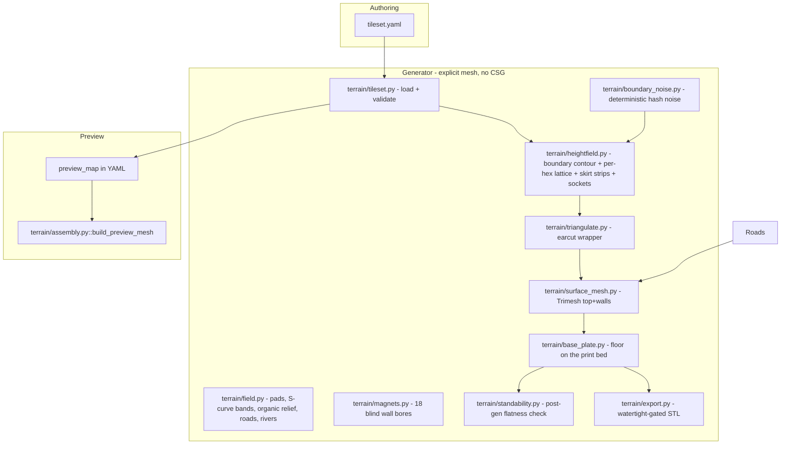

# 3D modular hex-flower terrain

> **Superseded design note:** this plan originally described refactoring the
> existing CSG/solid2/BOSL2 generator (`printableFiles/hexagon.py`) with a
> named edge-profile catalog. That approach was replaced entirely by an
> **explicit-mesh** generator — heightfield-driven vertices/faces via
> `trimesh`, no CSG booleans, no profile catalog (matching is direct numeric
> equality of 4-corner height sequences instead). This document has been
> rewritten to describe the system as actually built. The full phase-by-phase
> build log — every bug found, why each library was chosen, every design
> decision and its rationale — lives in
> [`.claude/plans/elegant-twirling-scott.md`](../../.claude/plans/elegant-twirling-scott.md);
> this file is a shorter, stable summary of the result.

**Overview:** A declarative 3D terrain system built around the existing
7-hex flower unit: discrete per-hex height levels, a true 18-edge zigzag
silhouette (not a simplified hexagon) as the physical mating boundary,
deterministic hash-based noise for the jagged boundary contour, engraved
per-hex grooves, roads/rivers that cross flower boundaries, and a tileset
YAML that drives sample flowers plus a manual combined preview map.

## What was built (shared understanding)

A **tabletop hex terrain product** where the printable unit is the **7-hex
flower**, magneted on exterior sides. Each flower is one sculpted, welded
solid (terrain surface + base plate), not a CSG assembly of separate pieces.

**Gameplay/design rules:**

- Each of the 7 hex cells declares a discrete height level. The interior height field (`terrain/field.py`) blends those levels: a seeded subset of hexes are standable plateaus (a dead-flat pad over 55% of the hex, a 6 mm S-curve band to each neighbour), the rest roll organically; the blend is one global function of position so independently triangulated cells meet exactly on their shared edges.
- Standability (**≥1 standable hex**, configurable, may be 0) is checked **after generation**, against the real mesh — not guaranteed by construction.
- Height levels: a configurable count (default 4), 15mm per level.
- No cap on the delta between adjacent boundary corners — cliffs are wanted, not a bug.
- Modularity across flowers is enforced by the flower's own true 18-edge silhouette, grouped into **6 sides of 4 corners each**. Two flowers may share a side only if their 4 corner-height sequences match numerically once correctly oriented (the neighbor declares the reverse sequence — see decision #4 below). No profile catalog.
- The fine jagged contour between a side's 4 corners is a **pure deterministic function** of (corner heights, position along the run) — bit-identical across independently-built flowers with matching declarations.
- The interior (everything not on the boundary) is freeform, seeded per flower, and never affects the boundary contract.
- Roads (16 mm wide, 1 mm below the smoothed terrain) and rivers (22 mm wide, 2.5 mm deep with 5 mm banks) run from hex centre to hex centre as straight legs with 15 mm fillets and cross a flower side at the midpoint of its middle edge, perpendicular to it - a point shared by exactly two flowers, where the bed is pinned to the declared contour height so the neighbour's copy continues exactly.
- Magnets: 18 blind wall bores per flower (one per silhouette edge) plus a top socket in every standable hex a road or river does not reach; 5 × 2 mm discs.
- Hex lines: a 1.0 × 0.6 mm V along every hex edge, each hex carrying half of it (a sunken "skirt"), so the V forms only where two hexes or two flowers meet.
- Authoring: a tileset YAML lists all flowers + a manual `preview_map`; auto-layout is out of scope.



## Tileset schema (as built)

One file per tileset, e.g. [`tilesets/default.yaml`](../../tilesets/default.yaml):

```yaml
meta:
  height_step_mm: 15
  level_count: 4
  scale: 5
  hex_outer_width: 5.1961525
  min_standable_hexes: 1

preview_map:
  - { id: flat_plains, at: [0, 0], rot: 0 }
  - { id: hill_peak, at: [-1, 1], rot: 0 }

flowers:
  flat_plains:
    hexes:  # indices 0=center, 1-6 ring
      "0": { height_level: 0 }
      # ... 1-6
    side_corner_heights:  # one 4-corner sequence per physical side, 0-5
      0: [0, 0, 0, 0]
      # ... 1-5
    seed: 1
    roads: []
    water: []

  hill_peak:
    hexes:
      "3": { height_level: 3 }
      # ...
    side_corner_heights:
      1: [1, 1, 3, 3]  # deliberate cliff, no intermediate slope step
      # ...
    seed: 7
```

**Validation rules (enforced at load time):**

- Every hex index 0–6 present, height level in range
- A side's last corner equals the next side's first corner (same-flower junction consistency — the same physical point)
- Road/water junction indices ∈ [0, 5], entry ≠ exit
- Grid-adjacent `rot=0` `preview_map` placements declare reversed-matching `side_corner_heights` on their facing sides

**No edge-profile catalog** — matching is exact numeric equality of the 4-corner sequence (once oriented correctly), not a compatibility table.

## Library choices

| Need | Choice | Why |
|---|---|---|
| Mesh representation + STL export | `trimesh` | `is_watertight`/`is_winding_consistent`/`volume`/STL export in one place |
| Triangulation (cell grooves, road regions, base-plate floor) | `mapbox_earcut` | Ear-clipping preserves every input polygon edge exactly — needed once fine boundary subdivision made unconstrained Delaunay unreliable on collinear/highly-symmetric point sets (see the full build log for the specific failures this fixed) |
| Deterministic jagged-contour + interior noise | Hand-written integer hash-based value noise (splitmix64-style, no trig) | Bit-exact reproducibility across machines/processes/Python versions rules out libm-based noise and Python's salted built-in `hash()` |

## Sample content (as shipped)

| Flower ID | Purpose |
|---------|---------|
| `flat_plains` | Uniform height 0 everywhere — simplest smoke-test case |
| `hill_peak` | A deliberate cliff on one side (no intermediate slope step) - demonstrates decision #7 |
| `crossroads` | A road and a river that ford each other at the centre hex, one level-2 plateau, one level-0 hex |
| `river_bend` | A river through level-0 ground (the deepest allowed bed) plus a road; its road continues `crossroads`' road across the shared side |

`preview_map` places all four: `hill_peak` at the one grid delta where its side matches `flat_plains`'s, and `river_bend` one flower to the right of `crossroads` so the road crosses the seam.

`tilesets/landscape.yaml` (generated by `scripts/gen_landscape.py`) is the real preview: 19 flowers filling a radius-2 hexagon of the flower grid, all derived from one elevation field (a level-0 valley along a river that crosses six flowers, hills to level 3, plains at level 1) with a road across five flowers that fords the river. `tests/test_landscape.py` builds all 19 and checks every seam vertex for vertex and every road/river crossing from both sides. Building it exposed a crease: the field's contour override let a hex's adjacent silhouette edge pull the level up to 1 mm off the declared contour along an edge, on one flower of each seam; now on an edge only that edge's contour speaks (`FieldParams.edge_silence_r`). `render tileset` writes the 19 printable STLs into a folder with a placement README, and `scripts/annotate_sides.py` draws which sides could go against each other.

## Success criteria (met)

- Edit YAML → regenerate flowers + a combined preview STL without touching generator code.
- Sides expose plain corner-height sequences; the validator rejects illegal `preview_map` adjacency and same-flower junction inconsistency.
- `render flower <id>` and `render preview` both produce a real, watertight, positive-volume STL, gated by `terrain/export.py` before any file is written.
- Full pytest suite (about 90 tests) asserts against real constructed geometry throughout, with zero references to the discarded CSG modules.

## Known, deliberately-flagged gaps (not hidden)

- `HexDef.height_level` drives the interior since 2026-09 (`terrain/field.py`). The corner-mismatch risk that stalled this earlier is handled by construction: the level blend is a global function of position, and a plateau's flat pad is a mask that is zero on every hex edge.
- Magnet bores: done (2026-09, `terrain/magnets.py`). The terrain walls now run straight to the print bed 10 mm below level 0 (`BASE_PLATE_DEPTH_MM`, physical millimetres) and each of the 18 silhouette edges gets a blind 5.3 × 2.2 mm bore centred 3.9 mm above the bed, cut into the wall as a structured radial-sector collar (no ear-clipping, no boolean). The boundary carries no XY jitter any more (2026-09-09: the walls bowed by up to 0.6 mm and the flowers did not sit flush), so every silhouette edge is one vertical plane; the bore's jitter-free window is kept as a guard should XY jitter ever be turned back on.
- Standability is decided up front: `pick_standable_hexes(seed, min_standable)` chooses which hexes get a flat pad, and `terrain/standability.py` then confirms them on the real mesh (central 40% of the hex flat within 1 mm). A plateau a road or river reaches is not standable and gets no socket.
- Road and river edges are sampled by the hex lattice (about 1.6 mm at the default 16 subdivisions per edge), so a road's 0.6 mm edge prints as a ramp one lattice step wide; the outline is not embedded as mesh edges.

## Explicitly out of scope

- Auto-map CSP generator
- Bridge/deck magnet toppings and dual-layer standable hexes
- Road + river combo on one corner
- Single-hex prints, web UI, game rules engine
